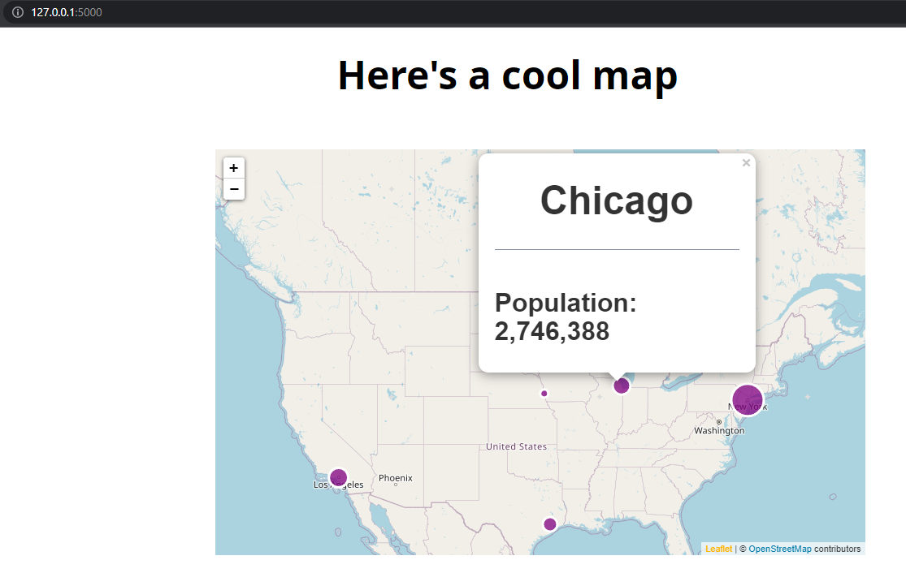

# Flask-leaflet example

Demonstration of producing a leaflet map in a full-stack app with flask.

## Setup
1. Clone this repo
2. Make sure you have an activated environment with flask, pandas, and sqlalchemy installed
3. on your terminal, run `python app.py`

## Notes
Leaflet.js requires you to provide your own css file. Look in `static/css` to see this file. Also make sure to follow the order of imports in `index.html`

